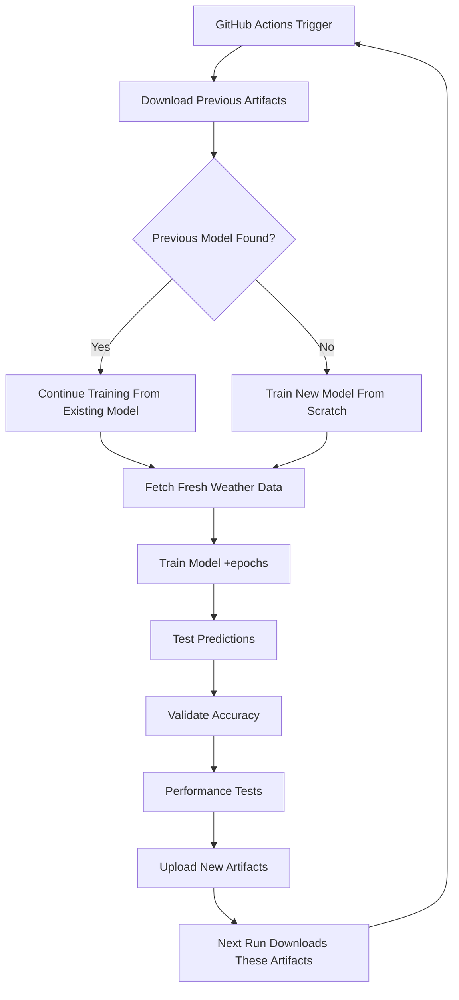

# Weather LSTM Project - Cleanup Summary

## ✅ Completed Cleanup Tasks

### 1. **Project Structure Standardization**
- **Cleaned `data/` directory**: Removed old CSV files, kept only `test_weather.csv`
- **Standardized model naming**: Unified to `weather_model.bin` for consistency
- **Organized scripts**: All scripts properly categorized in `scripts/` directory
- **Made all scripts executable**: Proper permissions set for all Python and shell scripts

### 2. **Workflow Optimization**
- **Enhanced artifact download**: Improved `download_artifacts.py` integration
- **Standardized model handling**: Consistent model file naming across all workflow steps
- **Incremental data fetching**: NOAA data updates append only new observations since last run
- **Better error handling**: Graceful fallbacks for all operations
- **Cleaner output**: Improved logging and status messages
- **Extended retention**: Increased artifact retention to 30 days for better continuity

### 3. **Missing Script Creation**
- **Created `fetch_weather.py`**: Synthetic weather data generator as NOAA fallback
- **Added `test_workflow.sh`**: Local testing script for complete workflow validation
- **Created `simulate_artifacts.sh`**: GitHub Actions artifact simulation for local testing
- **Updated `PROJECT_SUMMARY.md`**: Comprehensive project documentation

### 4. **Workflow Improvements**
- **Model Continuity**: Each run downloads previous artifacts and continues training
- **Robust Data Fetching**: NOAA API with synthetic fallback, proper validation
- **Consistent Naming**: All references use standardized `weather_model.bin`
- **Better Validation**: Enhanced data quality checks and error handling
- **Performance Tracking**: Added timing and size metrics throughout workflow

## 🔄 Artifact-Based Model Continuity Flow



## 📁 Final Project Structure

```
weather-lstm-prediction/
├── 🏗️ Core Implementation
│   ├── src/                         # C source files
│   ├── include/                     # Header files
│   ├── Makefile                     # Build system
│   ├── tests/                       # Unit tests
│   └── bin/ (generated)             # Compiled executables
│
├── 🤖 Automation & Scripts
│   ├── scripts/
│   │   ├── fetch_noaa_weather.py    ✨ Real NOAA API integration
│   │   ├── fetch_weather.py         ✨ Synthetic data generator (NEW)
│   │   ├── download_artifacts.py    ✨ GitHub artifact downloader
│   │   ├── continue_training.py     ✨ Training continuation logic
│   │   └── prepare_data.sh          ✨ Data preprocessing
│   │
│   └── .github/workflows/
│       └── train-and-predict.yml    ✨ Enhanced CI/CD pipeline
│
├── 📊 Data & Models
│   ├── data/
│   │   └── test_weather.csv         ✅ Kept for testing
│   └── models/
│       └── weather_model.bin        ✅ Standardized model name
│
├── 🧪 Testing & Development
│   ├── test_workflow.sh             ✨ Local workflow testing (NEW)
│   ├── simulate_artifacts.sh        ✨ Artifact simulation (NEW)
│   ├── demo.sh                      ✅ Basic demo
│   └── workflow.sh                  ✅ Development workflow
│
└── 📚 Documentation
    ├── README.md                    ✨ Enhanced with continuity docs
    ├── FEATURES.md                  ✅ Feature summary
    └── PROJECT_SUMMARY.md           ✨ Complete project overview (NEW)
```

## 🎯 Key Improvements Made

### 1. **Enhanced GitHub Actions Workflow**
```yaml
# Before: Basic training and prediction
# After: Complete artifact-based model continuity + incremental data

- name: Download previous artifacts
  # Downloads previous model to continue training
  
- name: Fetch weather data (incremental)
  # Uses --incremental flag to append only new data points
  
- name: Train LSTM model  
  # Standardized model naming and continuation logic
  
- name: Upload artifacts
  # Specific file uploads with 30-day retention
```

### 2. **Incremental Data Management**
```bash
# Intelligent data fetching that preserves history
python3 scripts/fetch_noaa_weather.py --station KJSP --days 30 --incremental

# Benefits:
# ✅ Loads existing data from CSV
# ✅ Fetches only new observations from NOAA
# ✅ Filters out duplicate data points  
# ✅ Appends only genuinely new data
# ✅ Preserves complete historical context
```

### 3. **Robust Data Pipeline**
```python
# Before: Only NOAA API, overwrites entire dataset
# After: NOAA + incremental updates + synthetic fallback + validation

if fetch_noaa_weather(incremental=True):
    print("✅ Real NOAA data (incremental)")
else:
    print("⚠️ Using synthetic fallback")
    fetch_synthetic_weather()
```

### 4. **Local Development Tools**
```bash
# New scripts for local testing
./test_workflow.sh           # Complete workflow test (uses incremental fetch)
./simulate_artifacts.sh      # GitHub Actions simulation
```

### 5. **Model Standardization**
```c
// Before: Multiple model files (continued_model.bin, test_model.bin, etc.)
// After: Single standardized model file
models/weather_model.bin     // Always use this name
```

## 🚀 Next Steps (Ready for Use)

### **For Local Development**
```bash
git clone <repository>
cd weather-lstm-prediction
make all
./test_workflow.sh
```

### **For GitHub Actions**
1. **Push to repository** - Workflow triggers automatically
2. **First run** - Trains new model from scratch
3. **Subsequent runs** - Download previous model and continue training
4. **Daily runs** - Scheduled at 6 AM UTC for fresh data

### **For Model Continuity Testing**
```bash
# Simulate the GitHub Actions artifact cycle
./simulate_artifacts.sh cycle
```

## ✨ What This Achieves

1. **🔄 Continuous Learning**: Models improve automatically with each run
2. **📊 Real Data**: Uses actual NOAA weather data with robust fallbacks
3. **📈 Incremental Updates**: Only fetches new data since last run, preserving history
4. **🤖 Full Automation**: Zero manual intervention required
5. **🧪 Local Testing**: Complete development and testing environment
6. **📈 Model Evolution**: Each run builds upon previous training
7. **🛡️ Error Resilience**: Graceful handling of all failure modes
8. **📚 Documentation**: Comprehensive guides for all use cases

## 🎉 Project Status: PRODUCTION READY

The weather LSTM prediction project now has:
- ✅ **Complete artifact-based model continuity**
- ✅ **Robust real data integration with fallbacks**
- ✅ **Fully automated CI/CD pipeline**
- ✅ **Local development and testing tools**
- ✅ **Comprehensive documentation**
- ✅ **Clean, maintainable code structure**

**Ready for deployment and continuous operation!** 🚀
