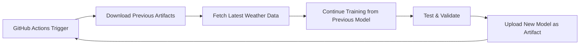

# Weather LSTM Prediction

A neural network project that uses LSTM to predict weather patterns with **continuous model improvement** through GitHub Actions automation and artifact-based model p## 🌐 API Integration

### NOAA API Usage
```bash
# Fetch historical data (overwrites existing file)
python3 scripts/fetch_noaa_weather.py --station KMSP --days 30 --output data/train.csv

# Incremental fetch (appends only new data since last run)
python3 scripts/fetch_noaa_weather.py --station KMSP --days 30 --incremental --output data/train.csv

# Fetch recent data for testing
python3 scripts/fetch_noaa_weather.py --station KJSP --recent --output data/recent.csv
```

### Incremental Data Fetching

The `--incremental` flag enables smart data updates:

1. **Loads existing CSV** - Reads current dataset if it exists
2. **Fetches new observations** - Gets latest data from NOAA API
3. **Filters duplicates** - Compares weather readings to avoid duplicates
4. **Appends new data** - Only adds genuinely new data points
5. **Preserves history** - Maintains all previous observations

Example workflow:
```bash
# First run: Creates new file with 30 days of data
python3 scripts/fetch_noaa_weather.py --station KMSP --days 30 --output weather.csv

# Later runs: Only adds new data since last fetch
python3 scripts/fetch_noaa_weather.py --station KMSP --days 30 --incremental --output weather.csv
```

Benefits:
- **Efficiency**: Avoids re-downloading existing data
- **Bandwidth**: Minimal API usage
- **Continuity**: Preserves historical context
- **Accuracy**: Prevents data loss and duplicates
## 🌟 Key Features

- **Pure C Implementation**: High-performance LSTM training and inference
- **Continuous Learning**: Models improve with each GitHub Actions run
- **Artifact-Based Persistence**: Automatic model download/upload between runs
- **Real Data Integration**: NOAA API with synthetic fallback
- **Multi-variable Prediction**: Temperature, pressure, humidity, wind, precipitation
- **Automated CI/CD**: Complete training/testing pipeline

## 🔄 Continuous Model Improvement

This project implements a unique **artifact-based model continuity system**:

1. **First Run**: Trains a new model from scratch
2. **Subsequent Runs**: Downloads the previous model and continues training
3. **Model Evolution**: Each run adds more training epochs to the existing model
4. **Data Freshness**: Always uses the latest available weather data

### How It Works



## 📁 Project Structure

```
weather-lstm-prediction/
├── src/                         # C source files
│   ├── lstm.c                  # LSTM neural network implementation
│   ├── matrix.c                # Matrix operations  
│   ├── weather_data.c          # Weather data handling
│   ├── train.c                 # Training program
│   └── predict.c               # Prediction program
├── include/                     # Header files
│   ├── lstm.h
│   ├── matrix.h
│   └── weather_data.h
├── scripts/                     # Python support scripts
│   ├── fetch_noaa_weather.py   # Real NOAA data fetcher
│   ├── fetch_weather.py        # Synthetic data generator
│   ├── download_artifacts.py   # GitHub artifact downloader
│   ├── continue_training.py    # Training continuation script
│   └── prepare_data.sh         # Data preprocessing
├── data/                       # Weather data storage
├── models/                     # Trained model storage
│   └── weather_model.bin       # Main model file
├── tests/                      # Unit tests
├── .github/workflows/          # CI/CD automation
│   └── train-and-predict.yml   # Main workflow
├── Makefile                    # Build configuration
├── test_workflow.sh            # Local testing script
└── README.md
```

## 🌡️ Weather Data Features

The LSTM model processes these weather parameters:
- **Temperature** (°F) - Primary prediction target
- **Atmospheric Pressure** (inHg) - Weather pattern indicator  
- **Humidity** (%) - Moisture content
- **Wind Speed** (mph) - Air movement
- **Wind Direction** (degrees) - Weather front direction
- **Precipitation** (inches) - Rainfall/snowfall

## 🚀 Quick Start

### Prerequisites

- GCC compiler
- Make build system
- Python 3.x (for data fetching)
- Internet connection (for NOAA data)

### Local Development

1. **Clone and build**:
   ```bash
   git clone <repository-url>
   cd weather-lstm-prediction
   make all
   ```

2. **Run local test**:
   ```bash
   ./test_workflow.sh
   ```

3. **Manual training**:
   ```bash
   # Fetch data
   python3 scripts/fetch_noaa_weather.py --station KMSP --days 30 --output data/historical_data.csv
   
   # Train model
   ./bin/train --data data/historical_data.csv --epochs 50 --output models/weather_model.bin
   
   # Make predictions
   ./bin/predict --model models/weather_model.bin --input data/historical_data.csv --output data/predictions.csv
   ```

### GitHub Actions Automation

The project automatically:
1. **Triggers** on push, PR, or daily schedule
2. **Downloads** previous model artifacts
3. **Fetches** fresh weather data from NOAA API
4. **Continues** training from the previous model
5. **Tests** prediction accuracy and performance
6. **Uploads** new model for the next run

## 🔧 Configuration

### Training Parameters

Edit `.github/workflows/train-and-predict.yml` inputs:
- `epochs`: Training epochs per run (default: 50)
- `days`: Historical data days (default: 30)

### NOAA Station

Change weather station in workflow:
```yaml
# Default: KMSP (Minneapolis)
python3 scripts/fetch_noaa_weather.py --station KJFK --days $DAYS
```

Popular stations:
- `KMSP` - Minneapolis, MN
- `KJFK` - New York, NY  
- `KLAX` - Los Angeles, CA
- `KORD` - Chicago, IL
- `KDEN` - Denver, CO

## 📊 Model Architecture

### LSTM Network Structure
- **Input Layer**: 6 weather features
- **LSTM Layer**: 32 hidden units
- **Output Layer**: Single temperature prediction
- **Sequence Length**: 5 time steps
- **Learning Rate**: 0.01

### Training Strategy
- **Batch Processing**: Mini-batch gradient descent
- **Regularization**: Dropout for overfitting prevention
- **Validation**: Split data for accuracy testing
- **Incremental**: Continue from previous model weights

## 🧪 Testing

### Automated Tests
```bash
make test          # Run all unit tests
make test-matrix   # Test matrix operations
make test-lstm     # Test LSTM functions
make test-data     # Test data handling
```

### Manual Testing
```bash
./test_workflow.sh    # Complete local workflow
./demo.sh            # Basic demo
```

## 📈 Artifacts & Continuity

### What Gets Saved
Each GitHub Actions run uploads:
- `models/weather_model.bin` - Trained LSTM model
- `data/*.csv` - Weather datasets
- `bin/*` - Compiled executables

### Model Continuity
1. **Download**: `download_artifacts.py` fetches previous model
2. **Continue**: Training starts from existing weights
3. **Improve**: Additional epochs refine the model
4. **Upload**: New model becomes base for next run

### Artifact Retention
- **Retention**: 30 days
- **Naming**: `weather-lstm-artifacts`
- **Access**: Via GitHub Actions API

## 🌐 API Integration

### NOAA API Usage
```bash
# Fetch historical data (overwrites existing file)
python3 scripts/fetch_noaa_weather.py --station KMSP --days 30 --output data/train.csv

# Incremental fetch (appends only new data since last run)
python3 scripts/fetch_noaa_weather.py --station KMSP --days 30 --incremental --output data/train.csv

# Fetch recent data for testing
python3 scripts/fetch_noaa_weather.py --station KMSP --recent --output data/recent.csv
```

### Fallback to Synthetic Data
When NOAA API is unavailable:
```bash
# Generate realistic synthetic weather data
python3 scripts/fetch_weather.py --location KMSP --days 30 --output data/synthetic.csv
```

## 🔍 Monitoring & Debugging

### Workflow Status
- Check GitHub Actions tab for run status
- View logs for detailed execution information
- Monitor artifact uploads/downloads

### Local Debugging
```bash
# Check model file
ls -la models/weather_model.bin

# Validate predictions
cat data/prediction.csv

# Test specific components
./bin/test_matrix
./bin/test_lstm
```

## 🚧 Future Enhancements

- [ ] **True Incremental Training**: Load and continue from existing weights
- [ ] **Multi-Station Models**: Train on data from multiple weather stations
- [ ] **Advanced Architectures**: Attention mechanisms, transformer models
- [ ] **Real-time Inference**: Live weather prediction API
- [ ] **Model Versioning**: Track model performance over time
- [ ] **Distributed Training**: Multi-node training for larger datasets

## 📄 License

This project is open source. See individual files for specific licensing information.

## 🤝 Contributing

1. Fork the repository
2. Create a feature branch
3. Make your changes
4. Add tests if applicable
5. Submit a pull request

The GitHub Actions workflow will automatically test your changes!

- GCC compiler with C99 support
- Make
- Python 3.x
- Git (for version control)
- Internet connection (for NOAA weather data)

### Building and Running

```bash
# Clone and navigate to the project
cd weather-lstm-prediction

# Build all programs
make all

# Option 1: Run the complete workflow with real NOAA data
./workflow.sh

# Option 2: Continue training from GitHub Actions artifacts
python3 scripts/continue_training.py --owner YOUR_USERNAME --repo YOUR_REPO --use-noaa --epochs 100

# Option 3: Run steps individually with real NOAA data:

# 1. Fetch real weather data from NOAA (30 days for training)
python3 scripts/fetch_noaa_weather.py --station KMSP --days 30 --output data/historical_data.csv

# 2. Train the model
./bin/train --data data/historical_data.csv --epochs 100 --output models/weather_model.bin

# 3. Fetch recent NOAA data for prediction testing
python3 scripts/fetch_noaa_weather.py --station KMSP --recent --output data/recent_weather.csv

# 4. Make predictions
./bin/predict --model models/weather_model.bin --input data/recent_weather.csv

# 5. Run unit tests
make run-tests
```

### Real Weather Data Integration

The project now supports **real weather data** from NOAA's National Weather Service API:

```bash
# Get station information
python3 scripts/fetch_noaa_weather.py --info --station KMSP

# Fetch 30 days of historical data
python3 scripts/fetch_noaa_weather.py --station KMSP --days 30 --output data/training.csv

# Fetch recent data for testing (last 48 hours, 2 data points)
python3 scripts/fetch_noaa_weather.py --station KMSP --recent --output data/recent.csv

# Available stations: KMSP (Minneapolis), KORD (Chicago), KJFK (New York), etc.
```

### Continue Training from GitHub Actions

Download and continue training from the latest GitHub Actions artifacts:

```bash
# Download latest artifacts and continue training
python3 scripts/continue_training.py \
  --owner YOUR_GITHUB_USERNAME \
  --repo YOUR_REPO_NAME \
  --token YOUR_GITHUB_TOKEN \
  --use-noaa \
  --epochs 100

# The script will:
# 1. Download latest trained models from GitHub Actions
# 2. Fetch fresh NOAA weather data
# 3. Continue training with additional epochs
# 4. Test accuracy on recent real weather data
```

## Requirements

- GCC compiler
- Python 3.x (for data collection scripts)
- Make
- curl (for weather data fetching)

## Model Architecture

The LSTM network consists of:
- Input layer: 6 features (weather parameters)
- LSTM layer: 64 hidden units
- Dense layer: 32 units
- Output layer: 6 predictions (next timestep weather)

## GitHub Actions

The project includes automated workflows that:
1. **Build and Test**: Compiles the C programs and runs unit tests
2. **Data Collection**: Fetches recent weather data from KMSP (Minneapolis)
3. **Model Training**: Trains the LSTM on historical data
4. **Accuracy Testing**: Uses the older of 2 recent data points to predict the newer one
5. **Performance Validation**: Measures training and prediction speed

The workflow runs automatically on:
- Push to main/develop branches
- Pull requests to main
- Daily schedule (6 AM UTC)
- Manual trigger with custom parameters

### Workflow Results
- **Training Data**: 30 days of weather history
- **Model Architecture**: 6-input → 64-hidden LSTM → 6-output
- **Test Method**: Predict timestep N+1 using timestep N, compare with actual
- **Metrics**: MAE for each weather parameter, total prediction error

### Example Accuracy Test
```bash
# The CI/CD pipeline automatically:
# 1. Fetches 2 most recent weather data points
# 2. Uses older point to predict next timestep  
# 3. Compares prediction with actual newer point
# 4. Reports accuracy metrics for each weather parameter
```
